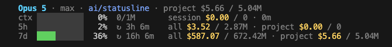
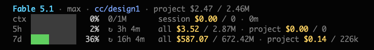

# cc-statusline

[](https://www.python.org/)
[](LICENSE)


A status line for [Claude Code](https://claude.com/claude-code). It shows how full your
context window is, what the current session and the current project have cost, and how much
of your 5-hour and 7-day limits you have used. It also tracks how long you work with Claude
Code per client, project, branch and task, so you can bill for it, and shows that time in the
line and in a local dashboard.



Everything runs on your machine with nothing but `python3`. The status line reads the
transcripts Claude Code already writes to disk and prices them with the public LiteLLM rate
table, which it updates once a day on its own. Time tracking records Claude Code's hook events
in a local SQLite database. There is no daemon, no Docker and no account to sign up for.

> [!IMPORTANT]
> **Every cost and token count here is an estimate**, worked out on your own machine at API
> list prices. On a Pro or Max subscription this is not what you pay — it is what the same
> usage would have cost through the API. See
> [Costs and tokens are estimates](#costs-and-tokens-are-estimates) for the full list of caveats.

## What it shows

- **Context window** — how full it is right now, matching the percentage Claude Code reports.
- **Session** — cost, tokens, and how long the session has been running.
- **Project** — what this working directory has cost in total, and inside each limit window.
- **Account** — what every session on the account spent inside the 5-hour and 7-day windows.
- **Limits** — how much of each window you have used, and when it resets.
- **Time** — the current task and today's time on it (see [Time tracking](#time-tracking)).

## Install

```sh
git clone https://github.com/lotyszm/cc-statusline.git
cd cc-statusline
python3 statusline.py --install
```

Then restart Claude Code: it reads `settings.json` only at startup.

`--install` does the following, and is safe to run again at any time:

- finds every Claude Code account directory in your home folder (`.claude`, `.claude-work`, …)
- backs up each `settings.json`, then adds the `statusLine` entry and the time-tracking hooks
- downloads the price table once, so the very first render already has real rates
- links the script as `~/.local/bin/cc-statusline` and writes a config template to
  `~/.config/cc-statusline/config.toml`
- imports the transcripts Claude Code still keeps (30 days by default), so reports have history
  from the start
- starts the dashboard at login on <http://127.0.0.1:8765/> (launchd on macOS, a systemd user
  unit on Linux)

| Option | Effect |
| --- | --- |
| `--no-tracking` | Status line only. Removes the time-tracking hooks if they were there. |
| `--no-dashboard` | Does not start the dashboard at login; `cc-statusline dashboard` opens it when you want it. |
| `--no-import` | Skips importing past transcripts (`cc-statusline import` does it later). |
| `--python=PATH` | The interpreter the hooks run with. By default the one running `--install`. |
| `DIR ...` | Account folders to set up, instead of all of them. |

A folder counts as an account if it contains a `projects/` folder or a `settings.json`, so an
account you have set up but never used is found as well.

> [!NOTE]
> `--install` writes the absolute path of `statusline.py` into `settings.json`. Keep the
> folder where it is, or run `--install` again after moving it.

### Only the status line

The status line is a single file and works on its own:

```sh
curl -O https://raw.githubusercontent.com/lotyszm/cc-statusline/main/statusline.py
python3 statusline.py --install
```

That gives you everything except time tracking, which needs the `tracker/` folder of the
repository. `--install` and `--doctor` say so, and the status line never nags about it.

### Updating

```sh
cd cc-statusline
git pull
python3 statusline.py --install
```

An update never changes your settings on its own. If a new version brings something that needs
the installer, such as the time-tracking hooks, the status line shows a dim `⏱ run --install`
until you run it.

### Requirements

- Python 3.9 or newer — the one that ships with macOS or your distribution is fine
- a terminal with 256-colour support
- macOS or Linux (Windows is untested)

### Manual setup

If you would rather not run the installer, add this to `~/.claude/settings.json` yourself. It
sets up the status line only:

```json
{
  "statusLine": {
    "type": "command",
    "command": "python3 \"/absolute/path/to/statusline.py\"",
    "padding": 1,
    "refreshInterval": 30
  }
}
```

## Reading the status line

### The header

```
Opus 5 · max · ai/statusline · ⑂ main · ⏱ 12345 1h 35m · project $5.66 / 5.04M
```

| Part | Meaning |
| --- | --- |
| `[claude-work]` | Account tag. Shown only when the account folder is not `~/.claude`. |
| `Opus 5` | The model in use. |
| `max` | Reasoning effort. |
| `ai/statusline` | Working directory, shortened to its last two parts. |
| `⑂ main` | Git branch, when you are inside a repository. |
| `⏱ 12345 1h 35m` | The current task and today's time on it, across sessions. Without a task: today's time on the project; `⏱ no task` turns amber in a billable project. |
| `project $5.66 / 5.04M` | What this project has cost in total, in dollars and tokens. Reads `new directory` when the project has no transcripts yet. |

Warnings are appended to the same line:

| Warning | Meaning |
| --- | --- |
| `⚠ no price data` | The price table has never been downloaded. |
| `⚠ prices 5d old` | No download has succeeded for 5 days. |
| `⚠ unpriced model` | A model used **in this project** is missing from the price table, so its rates are guessed. |
| `⏱ run --install` | Time tracking is here but its hooks are not set up yet, usually right after an update. |

### The `ctx` row

```
ctx ████▒▒▒▒▒▒  42%  84k/200k   session $1.87 / 6.4M · 1h 15m
```

- The bar shows how full the context window is. It counts input, cache writes and cache reads
  together, which is how Claude Code works out its own percentage.
- `84k/200k` — tokens currently in the context window, and the size of the window.
- `session $1.87 / 6.4M` — cost and tokens for this session only.
- `1h 15m` — how long the session has been open.

### The `5h` and `7d` rows

```
7d  ██████▒▒▒▒  63%  ↻ 3d 11h   all $367.60 / 429.51M · project $88.21 / 96.3M
```

- The bar shows how much of the limit you have used. **This percentage comes from Claude Code
  itself**, not from the script's own maths.
- `↻ 3d 11h` — time left until the window resets.
- `all` — what every session on this account spent inside that window.
- `project` — what this project alone spent inside that window.

Every cost keeps its own token count right next to it, in `$cost / tokens` form, so a number
is never read against the wrong label.

Both windows are measured from the reset time Claude Code reports, rather than counted
backwards from the current moment. That way the figures cover the same period the limit
itself covers. If Claude Code sends no limit data — when you use an API key instead of a
subscription, for example — the bars read `limit n/a`.

### `all` versus `project`

The same account, two different projects, a few seconds apart:




`all $587.07 / 672.42M` is identical in both, because it covers the whole account. `project`
is not: the first project spent $5.66 inside the 7-day window, the second only $0.14 — even
though that second project has cost $2.47 in total, as its header shows. Most of its work
happened more than seven days ago.

### Readings shared between sessions

Claude Code sends limit data only alongside a session's own API responses. A session sitting
idle therefore keeps reporting the last percentage it happened to see, which can be well out
of date.

To work around this, every session on one account writes its readings to a shared file in the
cache folder, and the highest reading for the current window wins — usage inside a window
only ever grows.

- A `~` after the percentage means the number came from another session rather than this one.
- If a session was idle while a window reset, it takes over the newer window completely,
  reset time included, so its cost figures cover the window that is actually running.

### Narrow terminals

Below 95 columns the line drops its least important details so that it still fits: the token
count next to each cost, and the session duration on the `ctx` row.

Bars turn amber at 70% and red at 90%.

## Time tracking

Claude Code runs a hook at every step of a session: when you send a prompt, when a tool starts
and ends, when it waits for your permission, when a reply is done. `--install` points those
hooks at `statusline.py hook`, which writes one row per event to a local SQLite database.
Reports are worked out from those raw events every time, so a change in the settings applies
to past days as well.

### How time is counted

- Time is the gaps between one session's events. A gap longer than **15 minutes** is a break
  and does not count; time you spend reading a reply and writing back within that counts.
- A running tool, such as a test suite or a build, counts until it ends, for at most
  **60 minutes**.
- Days are split at local midnight.
- Parallel sessions (`overlap = "split"`, the default): sessions for clients share the clock,
  so two sessions side by side do not bill the same hour twice, and your own projects get
  time only while no client session is active. `overlap = "full"` counts every session in full.
- `cc-statusline explain --session ID` shows how one session's time was counted, block by
  block, with every break.

### Clients and tasks

Rules in `~/.config/cc-statusline/config.toml` map a working directory to a client. Without any
rule, time adds up per project and the agent is never asked about tasks.

```toml
[[rule]]
path = "~/dev/clients/{client}/**"     # the folder name becomes the client
billable = true

[[rule]]
path = "~/dev/side-projects/**"
client = "own"
billable = false

[clients.acme]
rate = 150                              # optional: adds an amount column to reports
```

In a billable project, a session's time goes to a task:

- **From the branch** — a number in the branch name (`feature/12345/checkout`) or a Jira-style
  key (`PROJ-123`).
- **From the conversation** — when a prompt mentions something that looks like a task ID, the
  agent asks once, at the end of its reply, whether to log this session to it, and on your
  confirmation runs `cc-statusline task set`. Saying "this is task 12345" is enough.
- **Later** — the dashboard and `cc-statusline sessions --unassigned` list billable time without
  a task, and you can assign it there.

`[tasks]` in the config template shows how to change the ID patterns.

### Task keys per client

Two clients can use the same numbers: Redmine `48302` at one, Jira `CMS-100` at another that
also has a ticket 48302. With `namespace = true` under `[tasks]`, a task found in a branch, a
prompt or given to `task set` as a bare ID gets the client from the rules in front of it:

```toml
[tasks]
namespace = true      # feature/48302/x in ~/dev/clients/globex → globex:48302
```

A key that already has a `client:` part is kept as typed. Without the option, keys stay bare,
as before.

### What a task is about

Next to its title, a task can hold a description, a plan, a status and a link to its ticket.
The dashboard shows them when you open the task, above its hours and session titles.

```sh
cc-statusline tasks set globex:48302 --title "Checkout rounding" --status open \
    --url https://redmine.example.com/issues/48302 --plan @plan.md
cc-statusline tasks show globex:48302
cc-statusline tasks import tasks.jsonl      # one {"task": ..., "title": ..., "plan": ...} per line
```

Fields not given are kept, so setting a title never wipes a plan. An import is all or nothing:
one bad line and no task is changed.

### Commands

| Command | What it does |
| --- | --- |
| `cc-statusline report` | Hours per client and task, this month by default. `--last-month`, `--month 2026-09`, `--from`/`--to`, `--client`, `--by day,client,task`, `--format csv` or `md`. |
| `cc-statusline sessions --unassigned` | Billable sessions with time not logged to a task. |
| `cc-statusline task set ID --session S` | Logs a session's time to a task (`--from-start`, `--since HH:MM`, `--title`). `task clear` and `task show` too. |
| `cc-statusline tasks set ID` | Describes a task: `--title`, `--description`, `--plan`, `--status`, `--url`; `@file` or `-` reads the text. `tasks show`, `tasks list` and `tasks import FILE` too. |
| `cc-statusline explain --session S` | How a session's time was counted. |
| `cc-statusline dashboard` | Opens the dashboard, starting it if it is not running. |
| `cc-statusline import` | Backfills from transcripts. `--install` already does this once. |

`S` is a session ID or a unique prefix of one. Every command takes `--help`.

### Dashboard

<http://127.0.0.1:8765/> shows hours per day, per client and per task, what was done in each
session, and the time still waiting for a task, which you can assign from there. The CSV export
matches `cc-statusline report`.

Next to the chart, one day is broken down by task: its hours and the same hours rounded up to the
next quarter hour, with a total of each. Pick the day there or click it in the chart. Tasks under a
minute are listed apart with their real time; they count in the hours total but are not rounded.

`--install` starts it at login. It listens on 127.0.0.1 only and reads the database on every
request, so it never shows stale numbers. To drive it by hand, or after `--no-dashboard`, use
`bin/dashboard.sh start|stop|restart|status|logs`.

### Files

| Path | What it holds |
| --- | --- |
| `~/.config/cc-statusline/config.toml` | Rules, rates, the break and tool limits. |
| `~/.local/share/cc-statusline/tracker.db` | The events, sessions and task assignments. |
| `~/.local/share/cc-statusline/status/` | One small file per session, read by the status line. |
| `~/.local/share/cc-statusline/hook.log` | Hook errors. Hooks never fail a session; they log here. |

`XDG_CONFIG_HOME` and `XDG_DATA_HOME` move these, and `CC_STATUSLINE_CONFIG` and
`CC_STATUSLINE_DATA_DIR` point at a single file and folder.

## Costs and tokens are estimates

Claude Code does not tell the script what anything costs. The script adds up the `usage`
blocks in your transcript files and multiplies them by public API list prices. Everything
below follows from that.

- **On a subscription these are not your costs.** Pro and Max are flat-rate plans. The figures
  show what the same usage would have cost through the API.
- **"Project" means one directory.** Claude Code stores transcripts per working directory
  under `~/.claude/projects/`. The project figures cover the folder you started Claude Code
  in. Start it one level higher and that is a different project, with its own separate total.
- **Project history reaches back only as far as your transcripts do.** Claude Code deletes
  session data older than `cleanupPeriodDays`, which is 30 days by default. Once a transcript
  is deleted its cost disappears from the project total as well. Raise that setting in
  `settings.json` if you want a longer history. Tracked time is kept in the database and is not
  affected.
- **A few requests are counted twice.** Retries are removed inside a single transcript, but
  resuming a session copies part of the history into a new file. Measured against the
  transcripts this was built on, that came to roughly 1%.
- **A brand-new model may be priced from a guess.** Rates are matched by model id, with a
  built-in fallback for ids the feed has never seen. When that fallback is used, the header
  shows `⚠ unpriced model`. See [Prices](#how-it-works).
- **The price table can lag behind.** It refreshes once a day, and the LiteLLM feed itself
  needs time to pick up a change.
- **The limit percentages are not estimates.** The `5h` and `7d` bars come straight from
  Claude Code. Only the dollar and token figures beside them are calculated here.

This is also why the numbers never match `/cost` exactly. `/cost` reports Claude Code's own
accounting for the current session; this counts every transcript still on disk.

## Commands

| Command | What it does |
| --- | --- |
| `statusline.py` | Renders the line. Reads the session JSON on stdin — this is the call Claude Code makes. |
| `--install [DIR ...]` | Sets up the status line and time tracking. See [Install](#install) for the options. |
| `--uninstall [DIR ...]` | Removes what `--install` added. Recorded time and the config stay. |
| `--doctor` | Checks the setup: prices, accounts, hooks, the database, the dashboard, and how long a render takes. |
| `--prices` | Prints the rate table currently in use. |
| `--refresh-prices` | Downloads rates now and shows what changed since the last download. |
| `--clear-cache [DIR]` | Deletes one account's scan cache, shared limit readings and refresh lock. |
| `--config-dir=DIR` | Forces a specific account folder instead of detecting one. `--doctor` ignores this and always reports on every account it finds. |
| `--help` | Short usage summary. |

The time-tracking commands are listed under [Time tracking](#commands).

## Configuration

The status line is tuned in the `CONFIGURATION` block at the top of `statusline.py`; time
tracking in `config.toml` (see [Clients and tasks](#clients-and-tasks)).

| Setting | Default | Notes |
| --- | --- | --- |
| `LANG` | `"en"` | `"en"` or `"pl"`. Changes the labels only. |
| `LAYOUT` | `"gauges"` | `"gauges"`: four lines, bars aligned in one column. `"compact"`: two lines, bars side by side. |
| `BAR_W` | `10` | Bar width, in characters. |
| `BAR_STYLE` | `"solid"` | `"solid"` paints the bar with a background colour, which stays opaque on a transparent terminal. `"ascii"` draws `█` characters instead. |
| `SHOW_GIT` | `True` | The branch is read straight from `.git/HEAD`; no `git` process is started. |
| `SHOW_TIME` | `True` | The `⏱` segment. It reads one small file per session and never the database. |
| `C_*`, `BAR_*` | — | 256-colour numbers. Preview the grey ramp with `for i in $(seq 232 255); do printf "\033[48;5;${i}m %3d \033[0m" $i; done` |

`PRICES_TTL`, `PRICES_WARN_AFTER`, `REFRESH_LOCK_TTL` and `RECENT_DAYS` sit just below the
palette. Leave them alone unless you know why you are changing them.

### The compact layout

```
Opus 5 · max · ai/statusline · ⑂ main · project $5.66 / 5.04M
ctx ████▒▒▒▒▒▒  42% 84k/200k   5h ██▒▒▒▒▒▒▒▒  18%    7d ██████▒▒▒▒  63%    $1.87 session · $367.60 7d
```

## How it works

**Transcripts.** Every assistant message in `~/.claude/projects/*/*.jsonl` carries a `usage`
block. The script adds them up. It skips synthetic models and removes duplicates by
`(message id, requestId)`, so a retried request is not billed twice.

**Prices.** Rates come from the
[LiteLLM feed](https://github.com/BerriAI/litellm/blob/main/model_prices_and_context_window.json),
filtered down to Anthropic models. Cache-write and cache-read rates are read per model,
because they are not always a fixed fraction of the input price. A model id is matched exactly
first, then with the date suffix removed, then by the longest matching prefix — so a freshly
released `claude-opus-5-1-20261115` gets `claude-opus-5` rates before the feed catches up. If
nothing matches at all, a built-in family table takes over and the header shows
`⚠ unpriced model`.

The table is refreshed by a detached background process, at most once a day, and at most once
every 15 minutes when a download fails. A render never waits for the network: it uses whatever
is already on disk and starts a download for next time. After four days with no successful
download, the header says so.

**Caching.** Parsed transcripts are cached per file, keyed by modification time and size, and
the whole cache is dropped whenever prices change. A warm render takes a few milliseconds;
`--doctor` prints the real numbers for your machine.

Caches live in `$XDG_CACHE_HOME/cc-statusline`, or `~/.cache/cc-statusline`:

| File | What it holds |
| --- | --- |
| `prices.json` | The rate table, shared by every account. |
| `scan-*.json` | Parsed transcripts — one file per account. |
| `limits-*.json` | Shared limit readings — one file per account. |
| `refresh.lock` | Marks when a download was last attempted. |

`--clear-cache` removes these for one account.

**Multiple accounts.** The account folder is worked out from `transcript_path` in the data
Claude Code sends on stdin, so it is correct whether or not `CLAUDE_CONFIG_DIR` reaches the
subprocess. Several accounts can run side by side: each gets its own scan cache and its own
shared limit readings, and any account other than `~/.claude` is tagged in the header. Time
tracking records every account into the same database.

**Hooks.** A hook has to be quick and must never break a session. `statusline.py hook` reads
the event before importing anything else, writes one row (the database runs in WAL mode, so
parallel sessions do not block each other), and exits with status 0 even when something goes
wrong, logging the error to `hook.log`. The status line itself never opens the database: the
hooks keep a small status file per session, and that is what it reads.

## Privacy

Everything stays on your machine. The script makes exactly one outgoing request, to
`raw.githubusercontent.com`, for the price table. Time tracking stores timestamps, session
IDs, working directories, branch names, tool names, task IDs and a short title per session
(the first line of your first prompt, or the title Claude Code generates). It does not store
your prompts or code. The dashboard listens on 127.0.0.1 only and refuses requests for any
other host name.

## Troubleshooting

Start with `--doctor`. It reports which Python is running, how fresh the prices are, every
account it found and whether that account points at *this* file, whether the time-tracking
hooks are set up, the database, the dashboard, plus render timings.

**Nothing appears.** Restart Claude Code — `settings.json` is read only at startup.

**`⏱ run --install`.** The repository has time tracking, but this account's hooks are not set
up. Run `python3 statusline.py --install` and restart Claude Code. To keep the status line
without tracking, run `--install --no-tracking` instead.

**No `⏱` in a session.** Sessions that were already running when you installed keep their old
settings. Restart them.

**Bars are invisible or washed out.** On a transparent terminal, keep `BAR_STYLE = "solid"`.
If the empty part of the bar disappears into your background, raise or lower `BAR_TRACK`. On
a light theme, the grey defaults (`C_SEP`, `C_MUTED`, `BAR_TRACK`) are the first things to change.

**Numbers look wrong after you edited prices or the fallback table.** Run `--clear-cache`.

**`⚠ no price data`.** Run `--refresh-prices` to see the actual network error.

**The numbers do not match `/cost`.** They cannot — see
[Costs and tokens are estimates](#costs-and-tokens-are-estimates).

## Uninstall

```sh
python3 statusline.py --uninstall
```

It removes the `statusLine` entry, the hooks, the permission rule, the `cc-statusline` link and
the dashboard autostart, backing up each `settings.json` first. Your recorded time stays; delete
`~/.local/share/cc-statusline`, `~/.config/cc-statusline` and `~/.cache/cc-statusline` yourself
if you do not need them. Then delete the repository and restart Claude Code.

## Contributing

Issues and pull requests are welcome. The status line is `statusline.py` — open it and start at
the `CONFIGURATION` block. Time tracking lives in `tracker/`. The tests need nothing but Python:

```sh
python3 -m unittest discover -s tests -t .
```

They include a check that recounts random sessions second by second and compares the result
with the time the tracker reports.

## License

[MIT](LICENSE) © Maciej Łotysz
